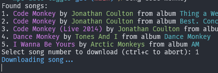
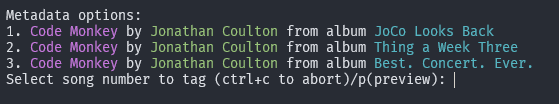
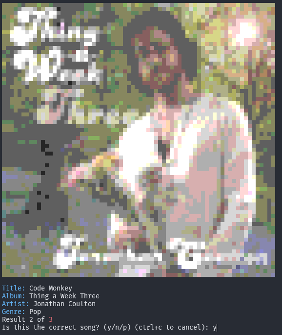

MP3 Tag Utilities
===================

These are two tools that work to download and tag mp3 files.
Song search is made using youtube music and tags are retreived from itunes free public api.

# Requeriments

It is important that this tools does not download perse the files, it is using [yt-dlp](https://github.com/yt-dlp/yt-dlp). As for today that is the only tool that works.

You'll need to install it first. Also youll need ffmpeg instaled to be able to convert the files to mp3.

Also node@20+ is needed.

# Install
Just clone, and `npm install`
Make sure that `song.mjs` and `tagger.mjs` have excution attributes.
(just run `chmod a+rx song.mjs` and `chmod a+rx tagger.mjs`)

To make all easier, you can add an alias into your `.zshrc` or `.bashrc`

```bash
alias song="path/to/song.mjs"
alias tagger="path/to/tagger.mjs"
```

# Usage
Once instaled, just execute:
```bash
$ song code monkey jonathan coulton
```
to look for song "Code Monkey" by artist "Jonathan Coulton".
Process will ask you to confirm download.

> You don't have to be very specific into your search.

If that is not the right song, just answer "n" and the process will be terminated to try again.

  

After downloading, it will try to get the correct meta tags from itunes free API.

  

There you'll be asked to confirm the album, artist and artwork. You can press "y" (yes) to confirm, "n" (no/next) to get next option or "p" (prev) for the previous option.

  

You can press `ctrl+c` anytime to cancel the tag process.

If the tagger breaks you can simply run it stand alone as

```bash
tagger your_file.mp3
```

Sometimes the tag process breaks, could be mainly for three reasons:

1 - The name of the song and artist is wrong: Try updating the filename as `<song name> - <artist>.mp3` and try again  
2 - Itunes service is offline: Just try again  
3 - The song you are looking for is way to unknown, you will have to tag it manually, use some tool like [mp3tag](https://www.mp3tag.de/en/)

By any of both methods once finished, you should have your song like this:

  
